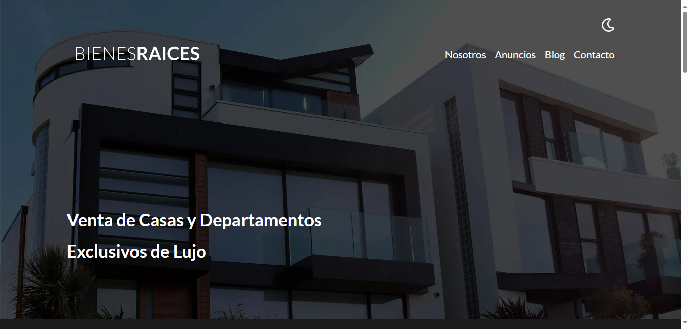
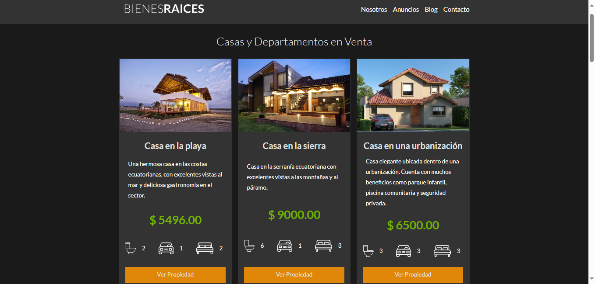
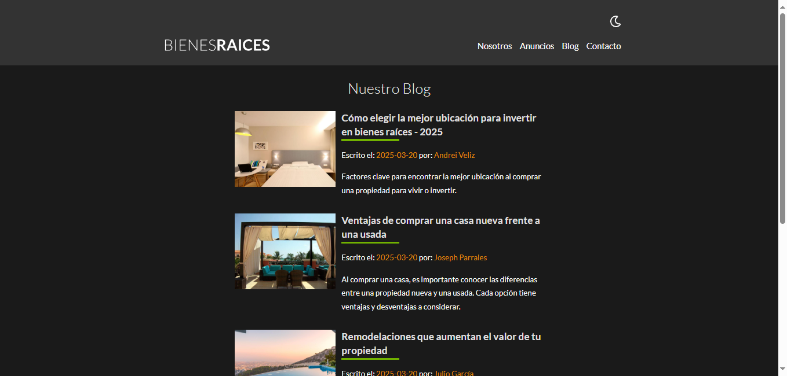
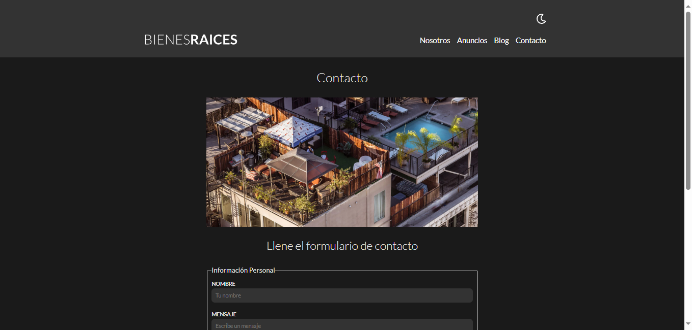
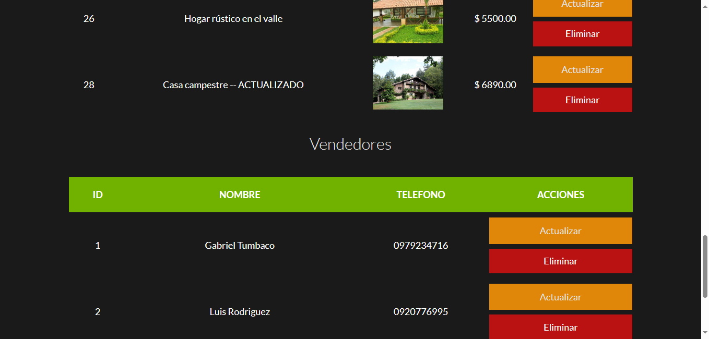
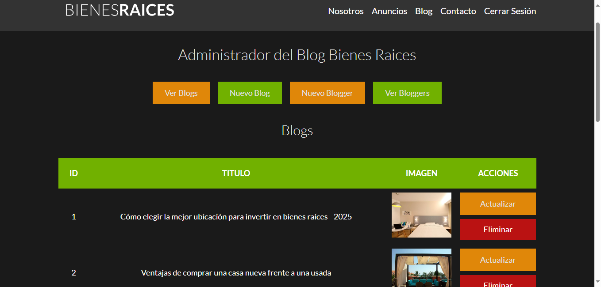
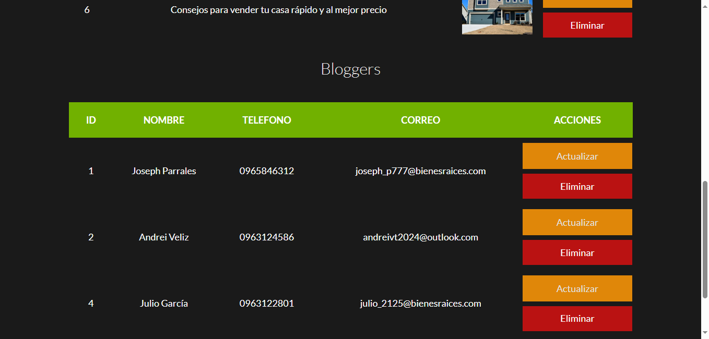

# 🏡 Bienes Raices
**BienesRaices** es un proyecto web para una empresa dedicada a la venta de propiedades. Esta plataforma permite publicar anuncios de propiedades y artículos de blog, estableciendo una conexión más cercana entre la empresa y sus clientes.

Este proyecto fue parte de mi formación como desarrollador web, donde aprendí los fundamentos clave del desarrollo backend y la integración con bases de datos.

## 📖 Descripción

Este backend permite al administrador gestionar la plataforma inmobiliaria de manera eficiente. Con él, puede:  

- **Administrar propiedades**: Crear, leer, actualizar y eliminar anuncios de propiedades en venta.  
- **Conectar con clientes**: Recibir correos electrónicos de interesados en comprar o vender una propiedad.  
- **Gestionar el blog**: Publicar, editar y eliminar artículos sobre el mundo inmobiliario.  

Además, proporciona a los usuarios una **experiencia de navegación cómoda y sencilla** a través de una interfaz **amigable e intuitiva**.

## 🛠 Tecnologías Usadas  

- 🟢 **PHP** - Lenguaje de programación para el desarrollo del backend.  
- 🗄 **MySQL** - Sistema de gestión de bases de datos relacional.  
- 🌐 **JavaScript** - Lenguaje de programación para la lógica del frontend.  
- 📄 **HTML** - Lenguaje de marcado para la estructura de la página web.  
- 🎨 **CSS** - Hojas de estilo para la presentación visual.  
- 🎨 **SASS** - Extensión de CSS para mayor flexibilidad y organización.  
- 🛠 **Node.js** - Entorno de ejecución para JavaScript, utilizado para los paquetes en el Gulp file. 

## 📸 Imágenes del Proyecto

Puedes ver el diseño completo del proyecto en el siguiente [repositorio de GitHub](https://github.com/Gatumbac/BienesRaices).

